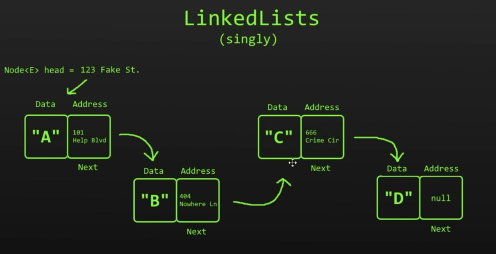
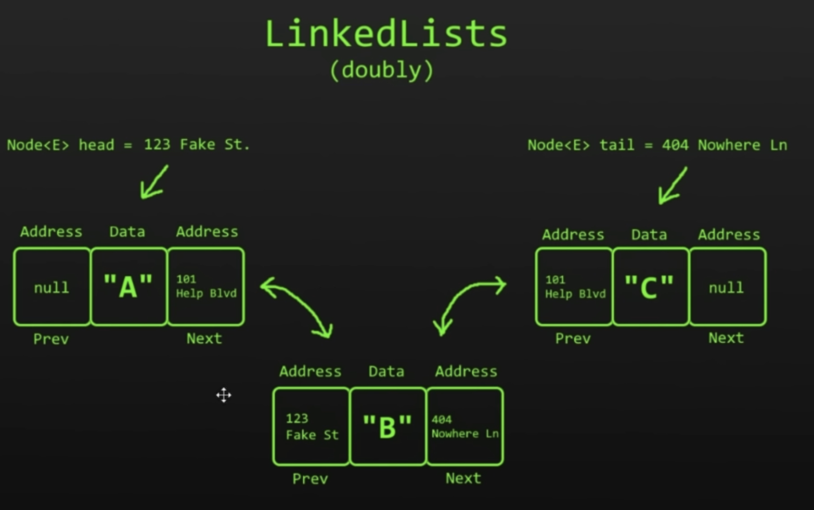

# Data Structures and Algorithms Notes

1. Basic data structures
2. Big O notation
3. Searching algorithms
4. Sorting algorithms
5. Graphs
6. Trees
   
## 1. What are data structures and algorithms?
**Data Structure:** a named location that can be used to store and organize data.

**Alogorithm:** a collection of steps to solve a problem.

## 2. Stacks
**stack** = LIFO data structure. Last-in First-Out
``` java
// push() to add on the top
// pop() to remove from the top
import java.util.Stack;

public class Main {
    public static void main(String[] args) {
        Stack<String> stack = new Stack<>();
        stack.push("Minecraft");
        stack.push("Doom");
        stack.push("Boarderlands");
        stack.push("LOl");  // Stack后进先出
        System.out.println(stack);

        for (int i = 0; i < 1000000000; i++) {
            stack.push("Doom");
        }
    }
}

```
### Uses of stacks?
1. undo/redo features in text editors
2. moving back/forward through browser history
3. backtracking algorithms (maze, file directories) // maze迷宫，file directories文档目录
4. calling functions (call stack)
   
## 3. Queues
**Queue** = FIFO data structure. First-In First-Out 
A collection designed for holding elements prior to processing 
**linear data structure**

```java
Queue<String> queue = new LinkedList<String>();
queue.enqueue

// add = enqueue, offer()   // add to the tail
// remove = dequeue, poll()    // remove from the head

import java.util.LinkedList;
import java.util.Queue;
import java.util.Stack;

public class Main {
    public static void main(String[] args) {
        Queue<String> queue = new LinkedList<String>();

        queue.offer("Karen");   // enqueue
        queue.offer("Chad");
        queue.offer("Steve");
        queue.offer("Harold");

        System.out.println(queue.peek());
        queue.poll();   // dequeue
        System.out.println(queue.peek());   // [Chad, Steve, Harold]
        System.out.println(queue.element());    // element() : Retrieves, but does not remove, the head of this queue, or returns null if this queue is empty.
                                                // Returns: the head of this queue, or null if this queue is empty
        System.out.println(queue.isEmpty());
        System.out.println(queue.size());
        System.out.println(queue.contains("Harold"));

    }
}

```

### Where are queues usefull?
1. Keyboard Buffer (letters should appear on the screen in the order they're pressed)
2. Printer Queue (Print jobs should be completely in order)
3. Used in LinkedLists, PriorityQueues, Breadth-first search

## 4. Priority Queues

**Priority Queue** = FIFO(First-In First-Out ) data structure that serves elements with the **highest priority** first before lower priority.

``` java
import java.util.*;

public class Main {
    public static void main(String[] args) {
        Queue<String> queue = new PriorityQueue<>(Collections.reverseOrder());
        // 正常是按字母顺序输出 A～Z
        // reverse后 Z～A

        queue.offer("B");
        queue.offer("C");
        queue.offer("A");
        queue.offer("F");
        queue.offer("D");

        while (!queue.isEmpty()){
            System.out.println(queue.poll());

        }


    }
}

```

## 5. LinkedLists
**LinkedList** = stores Nodes in 2 parts (data + address)
Nodes are in non-consecutive memory locations
Elements are linked using **printers**

### Advantages
1. Dynamic Data Structure (allocates needed memory while running)   // allocate 分配
2. Insertion and Deletion of Nodes is easy. O(1)
3. No/Low memory waste

### Disadvantages
1. Greater memory usage (additional pointer)
2. No random access of elements (no index [i])      // to find an element, we need to begin at one end towards the other end
3. Accessing/searching elements is more time consuming. O(n)

### Uses
1. implement stacks/Queues
2. GPS navigation
3. music playlist

### Varieties
#### 1. singly ~


**Benefits：**
1. ArrayLists: Inserting & Deleting are very difficult
2. 不连续 each node has the address of where the next node resigns
3. Insert node步骤：
   1. 把previous node里的address放到新node里 --> 新node指向了next node
   2. 把previous node的address改成新node的address
4. Delete node步骤：
   1. 把previous node的address指向next node的adress即可

#### 2. doubly ~

**Benefits:**
1. 从前从后都行（双向）
**Downside**
1. use more memory then singly LinkedList
   
``` java
import java.util.*;

public class Main {
    public static void main(String[] args) {
        LinkedList<String> linkedList = new LinkedList<String>();   // Doubly
        /*linkedList.push("A");
        linkedList.push("B");
        linkedList.push("C");
        linkedList.push("D");
        linkedList.push("E");
        linkedList.push("F");*/

        linkedList.offer("A");
        linkedList.offer("B");
        linkedList.offer("C");
        linkedList.offer("D");
        linkedList.offer("E");
        linkedList.offer("F");
        // linkedList.poll();

        linkedList.add(4,"HAHA");
        linkedList.remove("E");

        System.out.println(linkedList.indexOf("F"));
        System.out.println(linkedList.peekFirst());
        System.out.println(linkedList.peekLast());
        linkedList.addFirst("First");
        linkedList.addLast("Last");
        
        System.out.println(linkedList);

    }
}


```

## 6. Dynamic Array

Java: ArrayList

- Dynamic Array: size: 5, capacity: 6
- Static Array: size = capacity

**Advantages**

1. Random acces of elements O(1)
2. Good locality of reference and data cache utilization
3. Easy to insert/delete at the end

**Disadvantages**

1. Wastes more memory
2. Shifting elements is time consuming O(n)
3. Expanding/Shrinking the array is time consuming O(n)

```java
/**
/* Function: Write a Dynamic Array by hand
**/

public class Main{
	
	public static void main(String[] args) {

		DynamicArray dynamicArray = new DynamicArray(5);
		
		dynamicArray.add("A");
		dynamicArray.add("B");
		dynamicArray.add("C");
		
		//System.out.println(dynamicArray.get(0));
		//dynamicArray.insert(0, "X");
		//dynamicArray.delete("A");
		//System.out.println(dynamicArray.search("C"));
		
		System.out.println(dynamicArray);
		System.out.println("size: " + dynamicArray.size);
		System.out.println("capacity: " + dynamicArray.capacity);
		System.out.println("empty: " + dynamicArray.isEmpty());
	}
}
public class DynamicArray {

	int size;
	int capacity = 10;
	Object[] array;
	
	public DynamicArray() {
		this.array = new Object[capacity];
	}
	public DynamicArray(int capacity) {
		this.capacity = capacity;
		this.array = new Object[capacity];
	}
	
        public Object get(int index) {
            return array[index];
        }
	
	public void add(Object data) {
		
		if(size >= capacity) {
			grow();
		}
		array[size] = data;
		size++;
	}
	
	public void insert(int index, Object data) {
		
		if(size >= capacity) {
			grow();
		}
		for(int i = size; i > index; i--) {
			array[i] = array[i - 1];
		}
		array[index] = data;
		size++;
	}
	
	public void delete(Object data) {
		
		for(int i = 0; i < size; i++) {
			if(array[i] == data) {
				for(int j = 0; j < (size - i - 1); j++){
					array[i + j] = array[i + j + 1];
				}
				array[size - 1] = null;
				size--;
				if(size <=(int) (capacity/3)) {
					shrink();
				}
				break;
			}
		}
	}
	
	public int search(Object data) {
		
		for(int i = 0; i < size; i++) {
			if(array[i] == data) {
				return i;
			}
		}
		return -1;
	}
	
	private void grow() {
		
		int newCapacity = (int)(capacity * 2);
		Object[] newArray = new Object[newCapacity];
		
		for(int i = 0; i < size; i++) {
			newArray[i] = array[i];
		}
		capacity = newCapacity;
		array = newArray;
	}
	
	private void shrink() {
		
		int newCapacity = (int)(capacity / 2);
		Object[] newArray = new Object[newCapacity];
		
		for(int i = 0; i < size; i++) {
			newArray[i] = array[i];
		}
		capacity = newCapacity;
		array = newArray;
	}
	
	public boolean isEmpty() {
		return size == 0;
	}
	
	public String toString() {
		
		String string = "";
		
		for(int i = 0; i < capacity; i++) {
			string += array[i] + ", ";
		}
		if(string != "") {
			string = "[" + string.substring(0, string.length() - 2) + "]";
		}
		else {
			string = "[]";
		}
		return string;
	}
}
```


## 7. LinkedLists vs ArrayLists


## 8. Big O notation 


## 9. Linear search

- Linear search = Iterate through a collection one element at a time
- runtime complexity: O(n)
- Disadvantages:
  - Slow for large data sets
- Advantages:
  - Fast for searches of small to medium data sets
  - Does not need to sorted
  - Useful for data sturctures that do not have random access (Linked List)

```java
import java.util.ArrayList;
import java.util.List;

public class Main {

    public static void main(String[] args) {

        int[] array = {1,2,3,43,5,7,4,3};
        int index = linearSearch(array, 1);

        if (index != -1){
            System.out.println("Found" + index) ;
        } else {
            System.out.println("Not found");
        }

    }

    private static int linearSearch(int[] array, int value) {

        for (int i = 0; i < array.length; i++) {
            if (array[i] == value){
                return i;
            }
        }

        return -1;
    }
}

```

## 10. Binary search

- Hald of the array is eliminated during each "step"
- Advantages: large dataset
- O(log n)


## 11. Interpolation search

插值查找算法

-  = improvement over binary search best used for **"uniformly"* distributed data "guesses" where a value might be based on calculated probe results 
- if probe is incorrect, search area is narrowed, and a new probe is calculated

- average case : O(log(log)n)))
- worst case : O(n) [value increase exponentially]  （exponentially呈几何级数的）
- Mid = Begin + ( (End - Begin) / (A[End] - A[Begin]) ) * (X - A[Begin])
  - 式子中，各部分的含义分别是：
    - Mid：计算得出的元素的位置；
    - End：搜索区域内最后一个元素所在的位置；
    - Begin：搜索区域内第一个元素所在的位置；
    - X：要查找的目标元素；
    - A[]：表示整个待搜索序列。


## 12. Bubble sory

```java
import java.util.ArrayList;
import java.util.Arrays;
import java.util.List;

public class Main {

    public static void main(String[] args) {

        int[] array = {1,3,4,6,256,2,5};
        int temp;
        // 从小到大排序

        for (int i = 0; i < array.length - 1; i++) {
            for (int j = 0; j < array.length - 1 - i; j++) {
                if (array[j] >= array[j + 1]) {
                    temp = array[j + 1];
                    array[j + 1] = array[j];
                    array[j] = temp;
                }
            }

        }
    }
}

```

### 13. Selection Sort

- O(n^2)
- 


